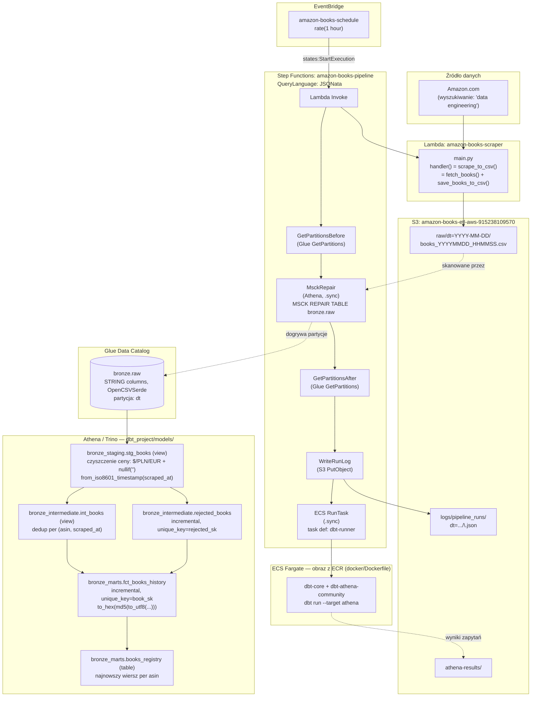

# Architektura projektu

## Status migracji

Migracja `amazon_books_ETL` (v1: Airflow + Postgres, on-prem) → v2 (serverless, AWS) jest
**zamknięta end-to-end**. v1 pozostaje zamrożony jako osobny artefakt portfolio.

| Faza | Zakres | Status |
|---|---|---|
| 0 | Konto AWS — MFA, budżet, IAM user, AWS CLI | ✅ |
| A | Szkielet repo — `git init`, chude `pyproject.toml`, usunięcie testów Airflow/Postgres | ✅ |
| B | `CLAUDE.md` pod AWS | ✅ |
| C | S3 — bucket + `save_books_to_csv()` → `boto3.put_object`, partycja `dt=YYYY-MM-DD/` | ✅ |
| D | Port dialektu SQL z Postgresa na Trino/Athena | ✅ (wchłonięte przez Fazę G) |
| E | Lambda — deploy scrapera (`amazon-books-scraper`) | ✅ |
| F | Glue Data Catalog (`bronze.raw`) — schemat ustalony **jednorazowo** przez Crawler | ✅ (Crawler NIE jest już częścią regularnego przebiegu — patrz niżej) |
| G | dbt na Athenie, uruchamiane jako kontener na ECS Fargate | ✅ |
| H | Step Functions + EventBridge — orkiestracja i harmonogram | ✅ (MVP; alerty Slack — otwarte) |
| I | CI/CD — GitHub Actions → deploy kodu Lambda | ⏳ zaplanowane |

Infrastruktura stawiana ręcznie przez CLI/konsolę AWS (świadoma decyzja: nauka, widoczność
każdego zasobu — nie Terraform/CDK; adopcja IaC odłożona do następnego projektu). Żeby zmiany
w orkiestracji nie ginęły poza gitem, `infra/` trzyma **jednokierunkowe zrzuty stanu** (AWS →
repo) odświeżane przez `scripts/dump_infra.sh` — szczegóły i trade-offy w `infra/README.md`.

## Przepływ danych

1. **Scraping** — `amazon-books-scraper` (Lambda, `main.handler`) wywołuje `scrape_to_csv()`:
   `fetch_books()` (czyste, bez I/O — sieć + parsing) + `save_books_to_csv()` (jedyny brzeg I/O,
   `boto3.put_object`). Zapis: `s3://.../raw/dt=YYYY-MM-DD/books_YYYYMMDD_HHMMSS.csv`. `scraped_at`
   powstaje raz na sesję (`datetime.now(timezone.utc)`), dzielony przez wszystkie wiersze —
   warunek dedupu w `int_books`. Autor scrapowany przez href `/e/ASIN`.

2. **Synchronizacja partycji (`MSCK REPAIR`, nie Crawler)** — `MSCK REPAIR TABLE bronze.raw`
   skanuje `raw/` i dogrywa nowe partycje `dt=...` do **już istniejącej** tabeli, bez dotykania
   schematu/SerDe. Glue Crawler (`amazon-books-raw-crawler`) był użyty **jednorazowo** do
   ustalenia schematu (22-07) — przy każdym pełnym rekrawlu potrafi rozbić tabelę na osobne
   tabele per partycja (powtórzyło się dwukrotnie, mimo identycznego schematu), więc **nie jest
   już częścią regularnego przebiegu**. `GetPartitionsBefore`/`GetPartitionsAfter` liczą partycje
   przed/po — skok większy niż jedna nowa = odzyskane zaległe dane (odpowiednik `run_type='backlog'`
   z v1), zapisywany do logu.

3. **Log przebiegu** — `WriteRunLog` zapisuje JSON do `s3://.../logs/pipeline_runs/dt=.../<run_id>.json`:
   `run_id`, `scraped_count`, `partitions_before/after/added`, `backlog_recovered`. S3 + Athena
   (nie DynamoDB) — spójność z resztą stacku, zero nowej usługi, zapytywalne SQL-em.

4. **Staging** (`stg_books`, widok) — typuje kolumny na dialekcie Trino: `cast(... as double)`,
   `from_iso8601_timestamp(scraped_at) at time zone 'UTC'`. Czyszczenie ceny obsługuje **wiele
   walut** (`$`, `PLN`, `EUR` — Amazon pokazuje różne zależnie od sesji) i puste stringi
   (`nullif(..., '')` **przed** castem — Trino, w przeciwieństwie do DuckDB, rzuca błędem na
   `CAST('' AS DOUBLE)`, nie zwraca cicho `NULL`).

5. **Intermediate** — `int_books` (widok, dedup przez `ROW_NUMBER()` per `(asin, scraped_at)`) i
   `rejected_books` (incremental, `unique_key=rejected_sk = to_hex(md5(to_utf8(...)))` — Trino
   liczy hash na bajtach, nie bezpośrednio na tekście jak Postgres).

6. **Marts** — `fct_books_history` (incremental, `unique_key=book_sk`) kumuluje historię wszystkich
   sesji; **brak filtra `WHERE scraped_at > MAX(...)`** — celowa ochrona late-arriving data
   (odziedziczona z v1): każdy `dbt run` skanuje całe `bronze.raw` i robi idempotentny merge, więc
   spóźniona partycja (np. po awarii wcześniejszego przebiegu) zostaje złapana automatycznie przy
   najbliższym udanym runie, bez dodatkowej logiki wykrywania backlogu. `books_registry` (tabela) —
   najnowszy wiersz per `asin`.

7. **Wykonanie dbt — kontener na ECS Fargate** — obraz (`docker/Dockerfile`, `dbt-core` +
   `dbt-athena-community`) budowany lokalnie/CloudShell, wypychany do ECR, uruchamiany jako
   pojedynczy task (`dbt-runner`) z `.sync` (Step Functions czeka na zakończenie). Region zawsze
   `eu-central-1` — role IAM (`ecsTaskExecutionRole`, `ECS-role-db03eec9`) mają w trust policy
   warunek `aws:SourceArn` zawężony do tego regionu.

8. **Orkiestracja** — `amazon-books-pipeline` (Step Functions, `QueryLanguage: JSONata`), wyzwalana
   przez `amazon-books-schedule` (EventBridge, `rate(1 hour)`). Rola `amazon-books-pipeline-role`:
   Lambda invoke, Glue (partycje + `GetDatabase`), ECS RunTask + PassRole, Athena, S3, oraz
   `events:PutTargets/PutRule/DescribeRule` na `StepFunctionsGetEventsForECSTaskRule` (wymagane
   przez wzorzec `.sync`).

   Stan `Lambda Invoke` ma **dwa bloki `Retry`**: infrastrukturalny (`Lambda.ServiceException` itd.,
   `IntervalSeconds: 1`) i aplikacyjny (`RuntimeError`, `MaxAttempts: 2`, `IntervalSeconds: 60`).
   Ten drugi łapie blokadę antybotową Amazona — długi odstęp jest celowy: scraper wyczerpał już
   własny backoff (~128 s), więc natychmiastowe ponowienie trafia w tę samą falę 503 i tylko pali
   płatny czas Lambdy.

## ⚠️ Pułapki, które już nas ugryzły (nie próbuj tego "naprawić" tymi samymi metodami)

- **Nie dodawaj `StartCrawler` z powrotem do regularnego przebiegu** — patrz krok 2 wyżej. To
  rozwiązany, nie "jeszcze nierozwiązany" problem.
- **`--full-refresh` na `fct_books_history`** — model akumuluje realną historię od 22-07;
  `--full-refresh` = `DROP` + odbudowa z bieżącego stanu źródła = utrata historii, tak jak w v1.
- **Trust policy roli IAM może być niewidocznie zawężona do regionu** (`aws:SourceArn`) — rola
  utworzona przez kreator konsoli w złym regionie (np. domyślny `us-east-1`) nie zadziała w
  `eu-central-1`, mimo że IAM samo w sobie jest usługą globalną.
- **`iam simulate-principal-policy`** do szybkiej diagnozy brakujących uprawnień — szybsze niż
  czekanie na propagację CloudTrail (kilkanaście minut opóźnienia) albo zgadywanie z ogólnego
  komunikatu błędu Athena/Hive (`DDLTask return code 1`).

## Kluczowe decyzje architektoniczne

| Decyzja | Uzasadnienie |
|---|---|
| Cała baza i projekt w chmurze, zero lokalnego Postgresa | Świadoma decyzja od startu migracji — v1 (Postgres) zostaje zamrożony i odizolowany |
| Crawler jako narzędzie **jednorazowe**, nie krok pipeline'u | Zawodny przy powtarzalnym pełnym rekrawlu tej samej wielopartycyjnej tabeli — rozbija na osobne tabele mimo spójnego schematu (potwierdzone dwukrotnie) |
| `MSCK REPAIR TABLE` jako mechanizm bieżącego dogrywania partycji | Nie dotyka schematu/SerDe, więc nie ma czego fragmentować; standardowe podejście dla tabeli o już ustalonym, stabilnym schemacie |
| dbt uruchamiany jako kontener na ECS Fargate, nie Lambda/Glue Python Shell | Najczęściej dokumentowany wzorzec społeczności dla dbt-core w produkcji na AWS (nie tylko moja rekomendacja — zweryfikowane wyszukiwaniem); Lambda ma limit 15 min i koncepcyjnie nie pasuje do ETL, Glue Python Shell nie miał realnego pokrycia w praktyce |
| `dbt-athena` (Trino), nie `dbt-glue` (Spark) | Athena/Trino: serverless, start zapytania w sekundach. Spark (Glue Interactive Sessions) ma narzut startu rzędu minut — nieuzasadniony przy tej skali danych (setki/tysiące wierszy) |
| Log przebiegu: S3 + Athena, nie DynamoDB | Spójność z resztą stacku (wszystko zapytywalne SQL-em), zero nowej usługi w architekturze |
| Brak filtra `is_incremental()`/`WHERE scraped_at > MAX(...)` w marts | Ochrona late-arriving data wpisana w logikę modelu (pełny skan + idempotentny merge po kluczu), nie osobny mechanizm wykrywania backlogu jak w v1 |
| Step Functions zamiast MWAA | MWAA rozlicza się za **istnienie** środowiska (~$0.49/h, 24/7), nie za wykonanie — dla rzadkiego, lekkiego pipeline'u to nieproporcjonalny koszt. Step Functions rozlicza się za faktyczne przejścia stanów |
| `QueryLanguage: JSONata` w Step Functions | Nowszy język wyrażeń w Step Functions (zamiast klasycznego JSONPath) — `$states.input`/`$states.result`, zmienne między stanami przez `Assign` |
| Czyszczenie ceny obsługuje `$`/`PLN`/`EUR` | Amazon pokazuje różne waluty zależnie od sesji/regionu — wykryte dopiero na realnych danych z wielu dni, nie w pierwszym teście |
| `nullif(..., '')` przed castem na `double` | Trino (w przeciwieństwie do DuckDB) rzuca błędem na `CAST('' AS DOUBLE)` zamiast cicho zwrócić `NULL` — złapane dopiero przy porcie na Athenę |
| `to_hex(md5(to_utf8(...)))` zamiast `md5(...)` | Trino liczy hash na bajtach (`varbinary`), nie bezpośrednio na tekście jak Postgres |
| Region zawsze `eu-central-1`, jawnie w każdej roli/komendzie | Konsola AWS nie synchronizuje regionu z CLI automatycznie — realna, powtarzająca się pułapka w tej sesji (role, podsieci, security groups) |
